<!-- Generated by cargo xtask docs. Do not edit by hand. -->

# Architecture dependency map

Derived from Cargo manifests. Check boundaries with `cargo xtask architecture`.

| Crate | Layer | Internal dependencies | Purpose |
| --- | --- | --- | --- |
| `nocterm` | app | `nocterm-acp`, `nocterm-agent`, `nocterm-ai`, `nocterm-connections`, `nocterm-containers-ui`, `nocterm-core`, `nocterm-design`, `nocterm-device-unlock`, `nocterm-files`, `nocterm-keymap`, `nocterm-keymap-ui`, `nocterm-local`, `nocterm-monitor-ui`, `nocterm-session`, `nocterm-settings`, `nocterm-settings-ui`, `nocterm-snippets-ui`, `nocterm-ssh`, `nocterm-terminal`, `nocterm-themes`, `nocterm-ui`, `nocterm-vault-ui`, `nocterm-workspace` | A fast, extensible SSH client. |
| `nocterm-acp` | adapter | `nocterm-ai`, `nocterm-core`, `nocterm-settings` | ACP subprocess adapter and authenticated terminal bridge. |
| `nocterm-agent` | feature | `nocterm-ai`, `nocterm-core`, `nocterm-session`, `nocterm-ui`, `nocterm-workspace` | ACP agent runtime, chat panel and terminal context. |
| `nocterm-ai` | domain | `nocterm-core`, `nocterm-settings` |  |
| `nocterm-connections` | feature | `nocterm-core`, `nocterm-session`, `nocterm-ui`, `nocterm-workspace` | Saved connections: profiles, recents, the sidebar list, the editor and the new-tab picker. |
| `nocterm-containers` | domain | `nocterm-session` | Containers on a host: listing, actions, logs and shells through the docker or podman CLI. |
| `nocterm-containers-ui` | feature | `nocterm-containers`, `nocterm-session`, `nocterm-settings`, `nocterm-ui`, `nocterm-workspace` | The active host's containers in the sidebar, with their logs and shells in tabs. |
| `nocterm-core` | foundation |  | Shared kernel: standard file locations and atomic, comment-preserving TOML persistence. |
| `nocterm-design` | foundation |  | Design tokens: the single source of truth for how nocterm looks. |
| `nocterm-device-unlock` | adapter | `nocterm-session`, `nocterm-vault` | Native authenticated vault key release for Linux, macOS and Windows. |
| `nocterm-files` | feature | `nocterm-session`, `nocterm-settings`, `nocterm-transfers`, `nocterm-ui`, `nocterm-workspace` | Local and remote Explorer with streaming file transfers. |
| `nocterm-keymap` | ui | `nocterm-core` | Key bindings: the default keymap, the user's changes and their merge. |
| `nocterm-keymap-ui` | feature | `nocterm-keymap`, `nocterm-settings`, `nocterm-ui`, `nocterm-workspace` | Keymap settings page: search, rebind and reset key bindings. |
| `nocterm-local` | adapter | `nocterm-session` | Portable local PTY session and program adapter. |
| `nocterm-monitor` | domain | `nocterm-session` | Host resource monitoring: collection scripts, parsers, rates and history. |
| `nocterm-monitor-ui` | feature | `nocterm-monitor`, `nocterm-session`, `nocterm-settings`, `nocterm-ui`, `nocterm-workspace` | The active host's resources in the status bar, with details and graphs. |
| `nocterm-session` | domain | `nocterm-settings` | Transport-agnostic session contract: commands, events, prompts and the remote file system. |
| `nocterm-settings` | foundation | `nocterm-core` | User settings: typed sections and the file that holds them. |
| `nocterm-settings-ui` | feature | `nocterm-ai`, `nocterm-session`, `nocterm-settings`, `nocterm-themes`, `nocterm-ui`, `nocterm-workspace` | Settings tab. |
| `nocterm-snippets` | domain |  | Snippet library, validation and connection matching. |
| `nocterm-snippets-ui` | feature | `nocterm-core`, `nocterm-session`, `nocterm-snippets`, `nocterm-ui`, `nocterm-workspace` | Contextual snippet panel and highlighted code editor. |
| `nocterm-ssh` | adapter | `nocterm-session` | SSH and SFTP transport, implemented with russh. |
| `nocterm-terminal` | feature | `nocterm-session`, `nocterm-settings`, `nocterm-ui`, `nocterm-vt`, `nocterm-workspace` | Terminal tab: renders a session's grid and drives its prompts. |
| `nocterm-themes` | domain | `nocterm-design` | Zed theme import, catalogue, registry and safe extension installation. |
| `nocterm-transfers` | domain | `nocterm-session` | Bounded bidirectional streaming transfer queues independent of the explorer. |
| `nocterm-ui` | ui | `nocterm-ai`, `nocterm-core`, `nocterm-design`, `nocterm-session`, `nocterm-settings`, `nocterm-themes` | GPUI glue: exposes design tokens and settings to views and maps them onto the component theme. |
| `nocterm-vault` | domain | `nocterm-session` | Portable encrypted credential vault and bounded worker service. |
| `nocterm-vault-broker` | app |  | Optional privileged Linux fingerprint verification and session-key broker. |
| `nocterm-vault-ui` | feature | `nocterm-session`, `nocterm-settings`, `nocterm-ui`, `nocterm-vault`, `nocterm-workspace` | Credential vault lifecycle and encrypted credential management UI. |
| `nocterm-vt` | domain |  | Terminal emulation: turns a byte stream into a grid and key presses into bytes. |
| `nocterm-workspace` | ui | `nocterm-keymap`, `nocterm-session`, `nocterm-settings`, `nocterm-ui` | Window shell: tab strip, sidebar and the registries features plug into. |
| `xtask` | tooling | `nocterm-ai`, `nocterm-design`, `nocterm-files`, `nocterm-monitor-ui`, `nocterm-session`, `nocterm-settings`, `nocterm-ui`, `nocterm-vault-ui` | Repository automation: generated documentation and architecture checks. |

```mermaid
graph TD
    nocterm --> nocterm_acp
    nocterm --> nocterm_agent
    nocterm --> nocterm_ai
    nocterm --> nocterm_connections
    nocterm --> nocterm_containers_ui
    nocterm --> nocterm_core
    nocterm --> nocterm_design
    nocterm --> nocterm_device_unlock
    nocterm --> nocterm_files
    nocterm --> nocterm_keymap
    nocterm --> nocterm_keymap_ui
    nocterm --> nocterm_local
    nocterm --> nocterm_monitor_ui
    nocterm --> nocterm_session
    nocterm --> nocterm_settings
    nocterm --> nocterm_settings_ui
    nocterm --> nocterm_snippets_ui
    nocterm --> nocterm_ssh
    nocterm --> nocterm_terminal
    nocterm --> nocterm_themes
    nocterm --> nocterm_ui
    nocterm --> nocterm_vault_ui
    nocterm --> nocterm_workspace
    nocterm_acp --> nocterm_ai
    nocterm_acp --> nocterm_core
    nocterm_acp --> nocterm_settings
    nocterm_agent --> nocterm_ai
    nocterm_agent --> nocterm_core
    nocterm_agent --> nocterm_session
    nocterm_agent --> nocterm_ui
    nocterm_agent --> nocterm_workspace
    nocterm_ai --> nocterm_core
    nocterm_ai --> nocterm_settings
    nocterm_connections --> nocterm_core
    nocterm_connections --> nocterm_session
    nocterm_connections --> nocterm_ui
    nocterm_connections --> nocterm_workspace
    nocterm_containers --> nocterm_session
    nocterm_containers_ui --> nocterm_containers
    nocterm_containers_ui --> nocterm_session
    nocterm_containers_ui --> nocterm_settings
    nocterm_containers_ui --> nocterm_ui
    nocterm_containers_ui --> nocterm_workspace
    nocterm_device_unlock --> nocterm_session
    nocterm_device_unlock --> nocterm_vault
    nocterm_files --> nocterm_session
    nocterm_files --> nocterm_settings
    nocterm_files --> nocterm_transfers
    nocterm_files --> nocterm_ui
    nocterm_files --> nocterm_workspace
    nocterm_keymap --> nocterm_core
    nocterm_keymap_ui --> nocterm_keymap
    nocterm_keymap_ui --> nocterm_settings
    nocterm_keymap_ui --> nocterm_ui
    nocterm_keymap_ui --> nocterm_workspace
    nocterm_local --> nocterm_session
    nocterm_monitor --> nocterm_session
    nocterm_monitor_ui --> nocterm_monitor
    nocterm_monitor_ui --> nocterm_session
    nocterm_monitor_ui --> nocterm_settings
    nocterm_monitor_ui --> nocterm_ui
    nocterm_monitor_ui --> nocterm_workspace
    nocterm_session --> nocterm_settings
    nocterm_settings --> nocterm_core
    nocterm_settings_ui --> nocterm_ai
    nocterm_settings_ui --> nocterm_session
    nocterm_settings_ui --> nocterm_settings
    nocterm_settings_ui --> nocterm_themes
    nocterm_settings_ui --> nocterm_ui
    nocterm_settings_ui --> nocterm_workspace
    nocterm_snippets_ui --> nocterm_core
    nocterm_snippets_ui --> nocterm_session
    nocterm_snippets_ui --> nocterm_snippets
    nocterm_snippets_ui --> nocterm_ui
    nocterm_snippets_ui --> nocterm_workspace
    nocterm_ssh --> nocterm_session
    nocterm_terminal --> nocterm_session
    nocterm_terminal --> nocterm_settings
    nocterm_terminal --> nocterm_ui
    nocterm_terminal --> nocterm_vt
    nocterm_terminal --> nocterm_workspace
    nocterm_themes --> nocterm_design
    nocterm_transfers --> nocterm_session
    nocterm_ui --> nocterm_ai
    nocterm_ui --> nocterm_core
    nocterm_ui --> nocterm_design
    nocterm_ui --> nocterm_session
    nocterm_ui --> nocterm_settings
    nocterm_ui --> nocterm_themes
    nocterm_vault --> nocterm_session
    nocterm_vault_ui --> nocterm_session
    nocterm_vault_ui --> nocterm_settings
    nocterm_vault_ui --> nocterm_ui
    nocterm_vault_ui --> nocterm_vault
    nocterm_vault_ui --> nocterm_workspace
    nocterm_workspace --> nocterm_keymap
    nocterm_workspace --> nocterm_session
    nocterm_workspace --> nocterm_settings
    nocterm_workspace --> nocterm_ui
    xtask --> nocterm_ai
    xtask --> nocterm_design
    xtask --> nocterm_files
    xtask --> nocterm_monitor_ui
    xtask --> nocterm_session
    xtask --> nocterm_settings
    xtask --> nocterm_ui
    xtask --> nocterm_vault_ui
```

